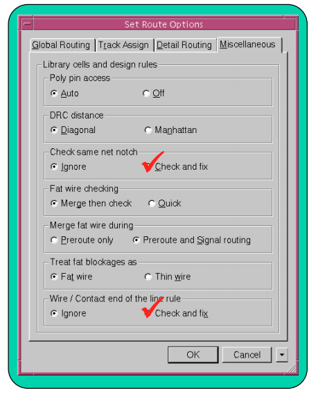

## ASIC Design II

### Week 1 Notes (Routing & Crosstalk)

---

#### Chapter overview

---

As in 90nm and below technologies interconnect delays started to play a crucial role on IC performanace and routing issue becomes a more significant problem. After all, routing substitues the idealized connection lines of IC by real physical structures and provides physical operation of the circuit in real exploitation conditions
 
 
Routing and its optimization are followed by finishing which prepares the designed IC for manufacturing

---

routing is the physical realization of all thos interconnects between pins which are connected by electrical circuit.

Those same interconnects provide signal and clock/power circuit realization and mmeet physical DRC and electrcial(timing, capacitanc/transmission, clock, etc) requirements

Globally interconnects must provide minimal distortions from circuit operation by ideal connecton lines to pass the operation through physical interconnects

#### General routing flow

---

Placement and CTS -> Route Clock Nets -> Route Signal Nets -> Optimize -> Design for Manufacturing (DFM)

- in all the design stages, preceding rouing (floorplan, placement, and cts), provision of better conditions has been the most important for further routing. This is also routability
- Generally IC Electrical circuits in the sense of functionality are divided into 3 groups (signal nets, clock nets, and power nets)
- Physical design of clock nets and power nets are performed in the routing stage

#### Grid Based Routing Design

---

\*Metal traces (routes) are built along and centered upon routing tracks based on grids

- Each metal layer has its own grid and preferred routing direction
  - M1: Horizontal
  - M2: Vertical
- The tracks and preferred routing directions are defined in a unitTile cell in the standard library
  

#### Peculiarities of Grid based routing system in IC Compiler

- the unitTile is used to define and store routing tracs and preferred directions information and is also part of the standard cell library
- The unitTile similar to a site defines several things
  - Minimum height and width a cell can occupy
  - Pitches in the preferred direction
  - Power and ground rails locations for standard cells
  - Height of the unit cell based on the metal 1 pitch (vertical) and must be a multiple of it
  - The width is based on the metal 2 (horizontal) pitch and must be a multiple of it
  - The metal 2 routing track defined in it must either be along the left side boundary or centerd in the unitFile

#### Routing Over Macros

- By default physical synthesis tool will generally do the following
- Route over macros
- Not route where there is a routing blockage
- Not route through a narrow channel in the non-preferred routing direction
  
- change the preferred routing direction
  - Use routing guide to change the preferred routing directions
  - Specify area in which to change the routing direction
    

#### Pre route checks

- use IC Compiler to check a design's prerequisite for detail routing
  - run after placement is completed
  - user the `check_routeability` command
  - **user before performing routing**
- output

  - a list of violations if any

#### Routing Operations

- IC Compiler performs
  - Global Routing
  - Track Assignment
  - Detail Routing
  - Search & Repair
- global route -> track assignment -> detail routing -> search & repair
- After Global routing, track assignment and detail routing all clcokc/signal nets will be completely routed and should meet all timing and most all DRC requirements
- Any remaning DRC violations can be fixed by Search & Repair

#### Route Operations: Global Route

- GR assigns nets to specific metal layer and global routing cells (Gcells)
- GR tries to avoid congested Gcell while minimizing detours
  - Congestion exists when more tracks are needed than available
  - detours increase wire length (delay)
- GR also avoids
  - P/G (rings/straps/rails)
  - Routing Blockages
- Metal traces exist after global route
  

##### Route Operations: Track Assignment

- Track assignment
  - Assigns each net to a specific track and lays down the actual metal traces
  - additionally it attempts to make a long straight traces and reduces the number of vias
  - This however does not check or follow physical DRC rules

#### Detailed Routing

- Detailed routing realizes the interconnection between each connected pair of pins in the region which has been defined with the result of global routing
  - Detailed routing also allows us to exactly define how each signal is routed through each region
  - It also seeks to reduce routing area
    

#### Route optimization

- Route optimization ca be done by reducing the wire lenght and number of vias and also by removing the unecessary jogs
- if the process is new or unproven then the reduction in via counts and the increase in long straight routes may improve yield
  

#### Post Route Optimization

- Performing cell sizing, buffer, and inverter section
- Powerful hold time fixing
- Topology based optimization
  
- This accounts for mismatch between pre-route and post-route delays
- Actual net delays are used instead of estimates done at pre-route
- Actual clock tree delays are propagated
- Remaining violations are fixed using standard-vt cells

#### PostRoute Clock Tree Optimization (CTO)

- Clock skew may have been disturbed by previous routing and route optimization activity
- The Clock tree optimization step can be used to improve the skew on the clock nets
  

#### Analysis of the routing DRC erros

- `verify_route` uses router DRC engine
- `verify_drc` uses hercules for DRC

##### Fixing DRC Errors

- To fix DRC errors use the following command
  - `route_opt -incremental` uses route_opt and fixes timing as well
    
- After routing, detailed nets are available and extraction can be more accurate. By default Elmore is used and Arnoldi can be turned on for postroute calculations

#### General Flow for Routing IC Compiler

- Before performing routing our designs must meet the following conditions
  - Power and ground nets have been routed after design planning and before placement
  - Clock tree synthesis and optimization have been performed
  - Estimated congestion is acceptable
  - Estimated timing is acceptable (about 0ns of slack)
  - Estimated maximum capacitance and transition have no violations
    
- placement - completed
- CTS - completed
- Power and Ground nets - routed
- Estimated congestion - acceptable
- Estimated timing -acceptable (~0ns slack)
- Estimated max cap/transition - no violations
  - `check_physical_design -for_routing`
- Routing created physical connections to all clock and signal pins through metal interconnects
  - routed paths must meet setup and hold timings, max cap/trans and clock skew requirements
  - Metal traces must meet physical DRC requirements
- Use IC Compiler to check a design's prerequisite for detail routing
  - make sure to run after placement is completed and use `check_routeability` command which would output a list of violations

#### Routng operations

- IC Compiler performs the following
  - Global Routing -> Track Assignment -> Detail Routing -> Search & Repair
  - After global routing, track assignment and detail routing of all clock/signal nets will be completely routed and should meet all timing and DRC requirements
  - Any remaining DRC violations can be fixed by search & repair

#### Global Routing Review

GR is topology aware and can avoid obstacles dynamically
As GR progresses, the congestion map is built. If more routes are required, throguh an already congested cell, IC Compiler may detour them through less congested ones. Theses detours cuase the wires to run through less optimum course through the Gcells and thuse, these wires will be longer and hence slower than desired. IC Compiler attempts to reroute wires that have some positive slack when timing driven GR is turned on. Prerouted wired segments are obstructions to new signal routes

global routing is the first stage of routing and provides global structure for organizing interconnects. The importance of global routing increases with the complexity of the IC. Global rouitng should inherently create good conditions for detailed routing

#### Route Operations: Detail Routing

Detail routing attempts to clear DRC violations using fixed size Sbox. Due to the fixed size of the Sbox, detail routes may not be fully able to clear all DRC violations

#### Search and Repair

Search and repair fixes remaining DRC violations through multiple loops using progressively larger Sbox sizes. Even if the design is DRC clean after search and repair, you must still run a sign-off DRC checker (hercules)
_ routing DRC rules are a subset of the complete technology DRC rules
_ IC compiler works on the FRAM vies and not the transistor level (CEL) view

#### Route Options

Options should be set prior to any routing and optimization step `set_route_options`

It is important to note that we must route clock nets first.

- route clock nets -> route signal nets -> optimize
- to route all clock nets at once use the following command `route_group -all_clock_nets`
- This allows the clocks to have free reign. If all nets are routed together, clock would not have any particular priority over other nets.
- 

#### Core Routing: route_opt

- Operations inside the `route_opt` can be finally tuned using the command `set_route_opt_strategy`
  - can be used to increase numebr of crosstalk reduction and crosstalk search and repair loops
  - increase the number of search and repair and ECO loops
  - optimize wire/via loops
  - set a run time limit

#### Galaxy Crosstalk

Cross talk is the transfer of a voltage across a switching net (aggresor) to another static or switching net (victim) through a coupling capacitance

At times, aggressor nets can created crosstalk induced noise on static victim nets also called static noise

Aggresor/victim nets with overlapping timing windows can cause crosstalk induced delay on victim nets. This can lead to a speed-up or a slow-down of the victim net

#### Crosstalk Prevention IC Compiler

During placement and optimization\
_ `set_max_transition`\
_ `set_congestion_options`\
_ `area_recovery_critical_range` and `power_recovery_critical_range`\
_ recommended to use 15% of main clock period
During Clock tress synthesis use non default routing rules\
_ `define_routing_rule my_route_rule -spacings {...} set_clock_tree_options [-clock CLK] -routing_rule my_routing_rule`
Define Global routing rule and track assign\
_ `set_si_options -delta_delay true -route_xtalk_prevention true`\

The IC Compiler address both crosstalk delta delay and static noise. Crosstalk correction performs both cell-based and route based optimization(i.e. optimized gate placement, gate logic, and routing traces)

- Nets can thus be placed and switch to different layers to reduce crosstalk without adding cells

#### Wire Sizing

`route_opt -wire_size`

- IC Compiler will apply the NDRs to violating nets if this reduces the timing violations . IC compiler will also use all NDRs that are defined in the designn with (define_routing_rule) unless certain rules are defined as dont_user like `set_routing_rule_dont_user "rule1 rule2"`
- Critical wires can be made wider to solve timing violations. Since R is reduced, it can benefit the timing. Thus, wider spacing helps crosstalk. Wire sizing should be used carefully since too many NDRs can make a design unrouteable

#### Engineering Change Order (ECO)

- Functional changes can occur late in the design cycle

##### Types of ECOs

- Non-freeze silicon ECO
  - Pre-tapeout enforces no restriction on placement or routing
  - Minimal disturbances to the existing layout
  - ECO cells are placed close to their optimal locations
- Freeze Silicon ECO
  - Post-tapeout - metal masks change only using previously inserted spare cells
  - Cell placement remains unchanged
  - ECO Cells are mapped to spare cells that are closest to the optimal location
  - Deleted Cells become spare cells

#### Non-Freeze Silicon ECO

#### Inserting Spare Cells For Freeze Silicon ECO

#### Protecting spare cell placement

Spare cells are dont_touch so IC Compiler doesnt reove the unconnected cels. Set the spare cells to soft fixed once the spare cells are distributed. It is important to use the `set_attribute` to set the spare cell to soft fixed.

The main reason it is important to set spare cells to soft fixed because the detailed placer may fail if there are too many fixed cells. The soft fixed attribute prevents incremental coarse placement from moving spare cells. The soft fixed cells can still be moved slightly and legalized by CTS and Routing Optimization.

### Freeze Silicon ECO: Metal Change Only

#### ECO Routing Example

