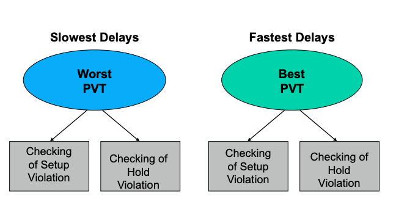
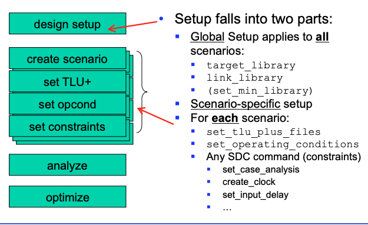

## ASIC Design II

### Week 2 Notes (Multi Scenario Optimization)

---

#### Chapter overview

---
* Multi Corner & Multi Mode analysis and optimization
* Multi Corenr & Multi Mode in interface logic model
* Design in IC Compiler environment

#### Analysis and optimization in IC design Flow

Current day designs must operate under multiple operating conditions(corners) and in multiple modes. These types of designs are refered to as multi corner or multimode or multiccorner-multimode designs. They can often times involve numerous operating condition corners and many nodes. 
* Typically a scenario is a mode or corner or both that can be analyzed and optimized
* A mode is defined by a set of clocks, supply voltages, timing constraints, and libraries. Additionaly, it can have annotation data such as SDF or parasitic files. 
* A corner is defined as a set of libraries characterized for a process, voltage, and temperature violations. 

#### Multi-corner problem
multi-corner optimization is obviously necessary at clock tree synthesis since clock trees have different variations due to ``gates (Clock tree buffers, ICGs)`` and ``Clock wires``

A corner is defined as a PVT and is provided to the tool as logic libraries per PVT and as parasitics data. 

#### Combination of Corners & Modes

##### Multiple Corners and Modes

#### fixing violations
Concurrent multimode and multicorner optimization works on all violations and on all scenarios thereby eliminating the convergence problems observed in sequential approaches. Optimization is performed for timing, power(leakage), noise, DRC, area, and etc. This type of optimization makes use of concurrent costing engine which ensures that every transformation is acceptable for all scenario costs

It is important to understand that a scenario refers to a corner or mode that can indeed be analyzed and or optimized

#### Sample Scenario

#### Adaptive Technology

#### Link libraries and PVT assumptions
Synthesis tools uses the nominal PVT values of each library in order to group libraries into different sets. Libraries with the same PVT values are grouped into the same set. The PVT of a scenario's max operating condition is used to select tha appropriate set.

#### Link libraries for multivoltage design

#### Multiple & Merged NLDM

#### NLDM & CCS

 
#### Multi NLDM Libraries

#### Hierarchical design flow

#### Multicorner - multimode flow of IC Compiler
In order to define scenarios, commands that specify the TLUplus libraries, operating conditions, and constraints are defined. However, other commands can be included. For example, for multimode scenarios, you can set ``set_max_leakage_power`` command to control power leakage on a per scenario basis or use the read_sdf command to set the correct net RC and pin-to-pin delay information in the respective scenario.

#### Multicorner/Multimode scenario setup (MC/MM)
setup typically falls into 2 categories. 
* Global Setup (applies to all scenarios)
  * ``target_library``, ``link_library``, ``(set_min_library)``
* Scenario specific setup pertains for each respective scenario
  * ``set_tlu_plu_files``, ``set_operating_conditions``
    * any SDC command applies constraints
      * ``set_case_analysis``
      * ``create_clock``
      * ``set_input_delay``

#### Global Setup
in the present example two libraries are used
    * Worst: abclib_max:abclib_max, operating cond.: abc_wc
    * Best: abclib_min:abclib_min,  operating cond.: abc_bc
Global variables must be set.
* ``lappend search_path ../ref/db``
* ``set __target_library__ "abclib_max.db abclib_min.db"``
* ``set __link_library__ "* abclib_max.db abclib_min.db ram_max.lib ..."``
in every scenario, IC compiler should be able to map to the library and operating conditions that are specified in the "max" corner

#### Scenarios
Scenarios are created one after the other each describing a mode and a corner. For example, in the image present below, scenario testing for functional and test mode with setup and hold int he worst and best corner using chip variation

#### Scenario Specific Setup
##### Scenario 1

##### Scenario 2

##### Switching between scenarios

##### CTS Single Scenario Rule

##### Leakage only scenario
You can focus on one scenario on leakage optimization only because you apply only the leakage optimization constraints and you significantly reduce the runtime and memory footprint as compared to other scenarios

#### MC/MM Timing Analysis
* ``report_qor`` is layered with info for each scenario
* ``report_timing -scenario`` all is used to report on all scenarios
* ``report_constraint``

#### Keep In Mind
Too many scenarios can lead to high memory and cpu demands. Reduce memory and runtime analysis by identifying the dominant scenarios. You can do this by creating a subset of essential scenarios for optimization.

In order to identify the dominant scenarios automatically use the following command
* ``set mcmm_enable_high_capacity_flow true`` which invokes the get_dominant_scenarios within the mega commands.

#### Launch vs Capture Path

since 'worst case' uses all slow delays, setup checks the best possible outcome in the following case.

Slow skew is propagated from mux output. Slow delays are computed for U4 and U5 but fastest possible capture path is needed. In this particular case, setup analysis is __optimistic__ for paths capturing CLK1!

##### On Chip Variation
On chip variation uses slow skews for the launch path and fast skews for the capture path. 

For hold, it the opposite. 

#### Analysis Summary

#### On chip variation Single Library

#### Multiple Libraries

#### Single Library + Derating

To apply derating factors, if no operating conditions exist for corners you wish to check, you have to derate the existing PVTs. Derating factors will scale the delay values. IC Compiler allows for global or specific derating. 
    * cells vs nets, launch path vs capture path, timing checks, library cells, early vs late
#### Global vs Specific Derating
* ``report_timing``
* ``report_timing -derate``

#### MC/MM Support for TLU+ files
* 3 TLU files are allowed per IC Compiler run
* anyone of the 3 TLU+ can have its resistance scaled using the operating conditions and this can be different for every scenario
* To scale resistance, capacitance, and coupling capacitance or a per scenario basis, user ``set_extraction_options -max / min_res_scale -max / min_cap_scale / -max / min_ccap_scale``
* after specifying the scaling values, run the ``extract_rc`` command to see the effect of scaling on the design's parasitics.

#### Filtering Coupling Capacitances
IC Compiler supports coupling capacitance filtering across scenarios. Thus to do this, after each scenario along with it TLU+ files and operating conditions, do the following
> * ``set_si_options -delta_delay true``
> * ``route_opt``
> * ``extract_rc -coupling_cap``
> * ``report_timing -scenario all``
* The ``route_opt`` command will take into account coupling and capacitance effects across the nets. 
In multicorner-multimode flow, the tool's extraction engine generates the parasitics per corner from the TLU+ files. 

#### TLU + Temperature scaling
if temperature scaling are specified in the TLU+ files, IC Compiler will use the operating temperature from the logical librry (db) operating condition to scael resistance. Temperature scaling of resistance must contain the following
* TLU+ must contain
  * Technology = 90nm_lib
  * GLOBAL_TEMPERATUR = 105.0 CONDUCTION metal8 [Thicknss = 0.8000 ...] CRT1 = 4.39e-3 CRT2 = 4.39e-7 (optional)
* Generates TLU+ with latest ``grdgenxo``
* if no parameters exist no scaling can be perfomed.

#### Delay Scaling With K-Factors in MC/MM
k-factors are used in some libraries to scale the delays in a linear fashion in order to model the effect of pvt. This is no longer accurate since delays dont scale linearly across all cells in modern libraries. K-factor scaling is not supported for MC/MM. The operating condition specified for each scenario must match the nominal operating condition for one of the libs in the __link_library__ list.
