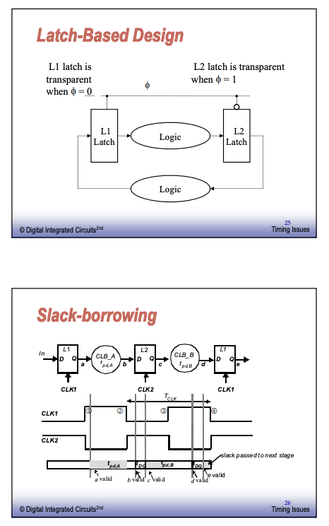

## Timing Issues
### Synchronous Timing

### latch parameters

### CLock Uncertainties

Clock uncertainties stem from the following
* clock definition
* devices
* power supply
* interconnect
* temperature
* capacitive load
* coupling to adjacent lines

### Clock Nonidealities
Clock Skew
* spatial variation in temporally equivalent clock edges; deterministic + random, T_sk

Clock Jitter
* Temporal variations in consecutive edges of the clock signal + random noise
* cycle-to-cycle (short term) T_js
* long term T_jl

Variation of the pulse width
 * important for level sensitive clocking

### Clock Skew & Jitter

#### Positive & Negative Skew

#### Timing Constraints

#### Impact of Jitter

#### Clock Constraints

#### Flip Flop Based Timing

### Example: DEC Alpha 21164
clock frequency: 300 Mhz - 9.3 Million Transistor
Total Clock Load: 3.75 nF
Power in clock distribution network: 20 W (out of 50)
Uses 2 level clock distribution
* Single 6-stage driver at the center of a chip
* Secondary buffers drive ledt and right side clock grid in Metal3 and Metal4. Total driver size: 58cm.

#### Self timed and asynchronous design
Functions of clock in synchronous design
* act as completion signal
* ensures the correct ordering of events

Truly asynchronous design
* Completion is ensured by careful timing analysis
* Ordering of events is implicit in logic

Self times design
* Completion ensured by completion signal
* Ordering imposed by handshaking protocol

#### Synchronizers & Arbiters
* Arbiter: Circuit to decide which of 2 events occured first
* Synchronizer: Arbiter with clock phi as one of the inputs
* Problem: Circuit HAS to make a decision in limited time - which decision is not important
* Caveat: It is impossible to ensure correct operation
* but we can decrease the error probability at the expense of delay

