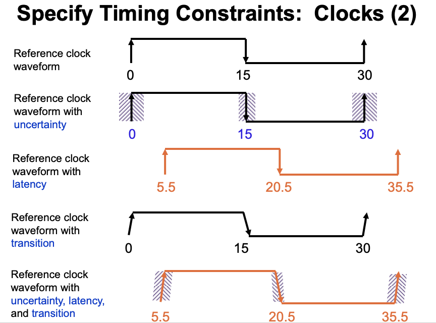
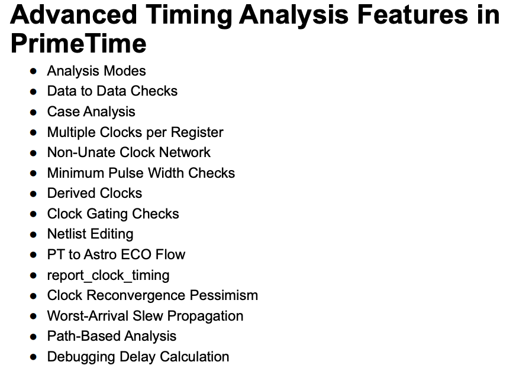

### Static Timing Analysis With Primetime & PT-SI
Agena
* Intro
* Basic Flow
* GUI
* Back Annotation
* Modelling
* Usability
* Signal Integrity Analysis
* Summary

#### What is STA
* Static Timing Analysis: a method of determining if a circuit meets timing constraints without simulating clock cycles
* How it works
  * identify timing startpoints and endpoints
    * inputs/outputs ports and registers/latches
  * Trace delays through timing paths from start to endpoints
  * compare path delays to clock period to see if constraints are met
  * also check hold violations (races) and transition violations (from library to design rules)
* STA is exhaustive, fast, and not dependent on simulation vectors

##### Primetime
* full gate level static timing analyzer
* PTSI is primetime signal integrity
  * extends PT's timing analysis to include signal integrity effects including
    * crosstalk delay
    * noise bumps
    * IR drop
  * SI effects analyzed in regular primetime environment and included in standard timing reports
  * Benefits
    * Fast accurate analysis of multi million gate designs
    * Much faster than traditional SPICE analysis
    * Can perform simultaneours Min and Max analysis

### Advanced Primetime
Primetime performs analysis based upon a single operating condition, BC_WC, and on chip variation (OCV)
- OCV provides the most accurate analysis and properly handles slew and delay variations
- single and BC_WC mode could be optimistic for delay calculation
- use report_design to see which analysis mode is being used

